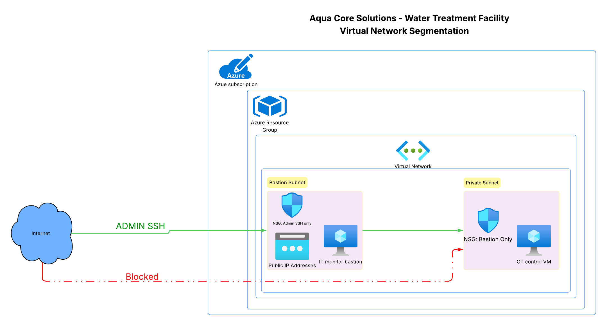

# aquacore-water-ot-segmentation

A two-tier Azure Virtual Network lab modeling IT/OT segmentation for a
water treatment facility — built manually first, then fully automated
via Azure CLI.

## Why this exists

In July 2026, attackers compromised 30+ Minnesota water utilities by
exploiting PLCs connected directly to the internet (CISA Advisory
AA26-097A). This lab demonstrates the actual remediation pattern CISA
recommended: no direct internet exposure for OT infrastructure, and
access restricted through a single controlled bastion path.

## Architecture



- **Bastion subnet** (10.0.1.0/24) — `vm-it-monitor-bastion`, public IP,
  NSG restricts inbound SSH to a single admin IP
- **Private/OT subnet** (10.0.2.0/24) — `vm-ot-control`, **no public IP**,
  NSG restricts inbound SSH to the bastion subnet only

## Files

- **`deploy.sh`** — Azure CLI script that builds the entire architecture
  from nothing: resource group, VNet, both subnets, both NSGs with
  correctly scoped rules, and both VMs.
- **`AUDIT_CHECKLIST.md`** — pass/fail review of the deployed
  architecture against the security controls it's meant to demonstrate.

## Usage

```
export ADMIN_IP="your.real.ip.address"
az login
bash deploy.sh
```

Your real IP is never hardcoded into the script — it's read from an
environment variable at runtime, so it's never committed to this repo.

## Debugging log: getting `deploy.sh` to actually deploy

This section exists on purpose. The path from "the script runs" to "the
script deploys successfully" wasn't clean, and I think the troubleshooting
is worth documenting rather than hiding — it's a more accurate picture of
real cloud work than a script that just worked the first time.

**Attempt 1 — `Standard_B2ats_v2`, West US 2:** failed with
`QuotaExceeded` — approved quota of 0 cores for the `standardBasv2Family`
in that region, despite this exact size having deployed successfully
earlier via the Azure Portal on the same subscription. CLI-based
deployments and portal-based deployments can hit quota checks
differently; this was the first sign of that.

**Attempt 2 — `Standard_B1s`, same region:** failed with a *different*
error, `SkuNotAvailable` due to capacity restrictions — not a quota
approval issue this time, but the datacenter itself reporting it had no
physical capacity for that SKU at that moment.

**Attempt 3 — switched region to East US 2, `Standard_B2s`:** same
capacity restriction, different region. At this point the pattern was
clear enough that guessing at sizes wasn't productive.

**Diagnosis, not guessing:** ran
`az vm list-sizes --location eastus2 --query "[?contains(name,'Standard_B')]"`
to see the actual catalog of B-series sizes Azure offers in that region,
rather than continuing to pick sizes blind.

**Attempt 4 — `Standard_B1ls`** (the smallest available B-series size):
still hit `SkuNotAvailable`. Four different B-series sizes across two
regions, same failure class — strong evidence this subscription's
access to burstable B-series capacity was broadly restricted, not a
one-off fluke.

**Resolution:** switched to `Standard_D2als_v7`, the exact size already
confirmed working from the earlier manual portal deployment on this same
account. Not the cheapest option, but a proven one — at this point,
reliability mattered more than optimizing for the lowest possible size.

**One more real issue along the way:** the script also hit a timing
race condition — subnets were being attached to NSGs before Azure had
fully finished registering those NSGs, causing intermittent
`ResourceNotFound` errors. Fixed with a short `sleep 15` between NSG
creation and subnet attachment.

**Final fix, also encountered late:** `IPv4BasicSkuPublicIpCountLimitReached`
— this subscription has zero quota for Basic SKU public IPs in this
region (Microsoft has been phasing Basic SKU out generally). Switched
`--public-ip-sku` from `Basic` to `Standard`.

After these six fixes, `deploy.sh` deployed the full architecture
successfully from a completely empty resource group, verified with real
deployment output showing both VMs running, the bastion with a public
IP, and the OT VM with none.

## Recommendations for production deployment

This lab intentionally simplifies several controls a production
deployment would require:

1. **Multi-admin access** — a single static admin IP doesn't scale to a
   real operations team. Production would route through a shared VPN
   egress point with one stable, auditable IP.
2. **Credential management** — this lab uses locally generated SSH keys.
   Production should use Azure Key Vault-backed credential management.
3. **Logging and monitoring** — this lab did not include NSG Flow Logs
   or centralized monitoring. Production deployments should capture and
   retain network flow data for audit and incident response.

Always delete the resource group after testing to avoid ongoing charges:
```
az group delete --name rg-aquacore-water-ot --yes
```
